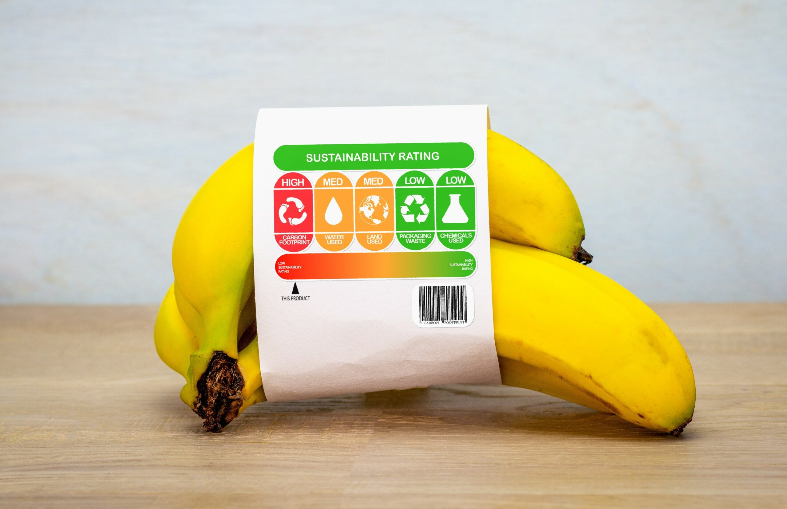
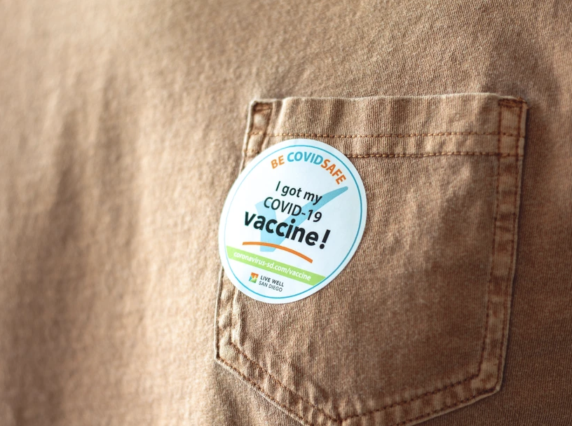
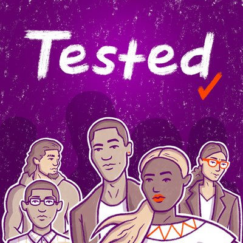
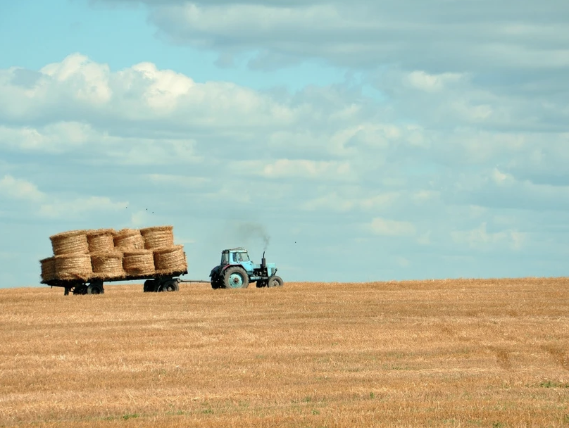

```{r}
#| echo: FALSE
```

<p class="description">

Pronounced <a href="https://www.name-coach.com/elhamyali" target="_blank">ill-huhm</a> (she/ella/هي)

</p>

📊 I'm a mixed-methods research leader, writer, and data journalist based in Southern California who translates community voices and local insights into data experiences from interactive maps to visual stories that reveal deeper truths about our world, shift norms, and drive action.

My work sits at the intersection of climate justice, health equity, and civic tech. Fore more than a decade, I’ve partnered with local and state governments to translate data into tools that reflect the lived realities of communities — from mapping tree canopy in the City of Akron to expanding pathways into high-quality green jobs in the City of Saint Paul — so cities can make confident decisions that protect both people and planet. 🌍🌿

Here's a sample of my work.

## Select Stories

I lead end-to-end data storytelling — from sourcing and reporting to data collection, analysis, visualization, and building interactive stories — then partner with communications and PR teams to bring them to wider audiences.

:::::: grid
::: {.g-col-12 .g-col-md-4}
<a href="https://beeckcenter.georgetown.edu/report/2025-impact-report/section-3/#it-takes-a-village"    target="_blank" rel="noopener noreferrer">  </a>
:::

:::: {.g-col-12 .g-col-md-8}
::: story-title
<a href="https://beeckcenter.georgetown.edu/report/2025-impact-report/section-3/#it-takes-a-village"      target="_blank" rel="noopener noreferrer"> “It Takes a Village”: Counted, Connected, and Cared For</a>
:::

Inside Arizona’s effort to link health and homelessness data through the Beeck Center’s award-winning Data Labs program.
::::
::::::

:::::: grid
::: {.g-col-12 .g-col-md-4}
<a href="https://beeckcenter.georgetown.edu/report/2025-impact-report/section-2/#family-health-by-design"    target="_blank" rel="noopener noreferrer">  </a>
:::

:::: {.g-col-12 .g-col-md-8}
::: story-title
<a href="https://beeckcenter.georgetown.edu/report/2025-impact-report/section-2/#family-health-by-design"      target="_blank" rel="noopener noreferrer"> Family Health, by Design</a>
:::

How fragmented public systems shape the well-being of young families in California and what it would take to design them to actually work together.
::::
::::::

:::::: grid
::: {.g-col-12 .g-col-md-4}
<a href="https://beeckcenter.georgetown.edu/report/2025-impact-report/section-1/#a-place-to-land"    target="_blank" rel="noopener noreferrer">  </a>
:::

:::: {.g-col-12 .g-col-md-8}
::: story-title
<a href="https://beeckcenter.georgetown.edu/report/2025-impact-report/section-1/#a-place-to-land"      target="_blank" rel="noopener noreferrer">A Place to Land</a>
:::

How connecting the right people turns research into action, advancing more accessible public benefits through the Beeck Center’s Digital Benefits Network.
::::
::::::

:::::: grid
::: {.g-col-12 .g-col-md-4}
<a href="https://beeckcenter.georgetown.edu/report/2025-impact-report/section-1/#building-government-services"    target="_blank" rel="noopener noreferrer">  </a>
:::

:::: {.g-col-12 .g-col-md-8}
::: story-title
<a href="https://beeckcenter.georgetown.edu/report/2025-impact-report/section-1/#building-government-services"      target="_blank" rel="noopener noreferrer">Building Government Services is a Team Sport</a>
:::

A window into the people behind digital government — following one practitioner’s experience navigating collaboration, constraints, and impact through the Digital Government Network.
::::
::::::

:::::: grid
::: {.g-col-12 .g-col-md-4}
<a href="https://screening-tools.com/blog/pedp-environmental-justice-data-tools-story"
   target="_blank" rel="noopener noreferrer">  </a>
:::

:::: {.g-col-12 .g-col-md-8}
::: story-title
<a href="https://screening-tools.com/blog/pedp-environmental-justice-data-tools-story"
     target="_blank" rel="noopener noreferrer"> 2,212 studies used disappearing federal climate justice tools. We analyzed them all.</a>
:::

The inaugural story <a href="https://screening-tools.com/blog/made-possible-series" target="_blank" rel="noopener noreferrer">Made Possible</a>, a Public Environmental Data Partners series spotlighting those who use now-defunct federal environmental justice tools to serve their communities.
::::
::::::

:::::: grid
::: {.g-col-12 .g-col-md-4}
<a href="https://beeckcenter.georgetown.edu/saint-paul-climate-resilience-equity-green-jobs/"
   target="_blank" rel="noopener noreferrer">  </a>
:::

:::: {.g-col-12 .g-col-md-8}
::: story-title
<a href="https://beeckcenter.georgetown.edu/saint-paul-climate-resilience-equity-green-jobs/"
     target="_blank" rel="noopener noreferrer"> Climate resilience requires equitable access to quality green jobs. Saint Paul is making strides. </a>
:::

Using user research from the City of Saint Paul and national datasets, I analyzed racial and income inequities in access to quality green jobs across three sectors. The findings were featured on the Beeck Center's <a href="https://beeckcenter.georgetown.edu/saint-paul-climate-resilience-equity-green-jobs/" target="_blank" rel="noopener noreferrer">website</a>, <a href="https://beeckcenter.georgetown.edu/report/2024-impact-report/present/" target="_blank" rel="noopener noreferrer">annual impact report</a> and <a href="https://fullstacksaintpaul.com/climate-resilience-requires-equitable-access-to-quality-green-jobs-saint-paul-is-making-strides/" target="_blank" rel="noopener noreferrer">Full Stack Saint Paul</a>.
::::
::::::

:::::: grid
::: {.g-col-12 .g-col-md-4}
<a href="https://beeckcenter.georgetown.edu/the-heart-of-topcities/"
   target="_blank" rel="noopener noreferrer">  </a>
:::

:::: {.g-col-12 .g-col-md-8}
::: story-title
<a href="https://beeckcenter.georgetown.edu/the-heart-of-topcities/"
     target="_blank" rel="noopener noreferrer"> The Heart of TOPCities </a>
:::

A multimedia story that blends qualitative research, survey analysis, and community audio to show how residents and local governments co-designed digital tools to tackle blight, extreme heat, and access to household energy credits in U.S. cities.
::::
::::::

## Projects

::::::::::::::: featured-work
::: work-item
```         
```

[](/featured-work/pima-county-health-department/index.qmd)

COVID-19 vaccine delivery for Latina/o/e pregnant people
:::

::: work-item
```         
```

[](/featured-work/washington-state-board-health/index.qmd)

Decisions to require COVID-19 vaccination for school entry
:::

::: work-item
```         
```

[{fig-alt="Image of a U.S. flag being held by a white hand with a blurred background"}](/featured-work/us-digital-response/index.qmd)

COVID-19 crisis delivery for 19+ local and state governments
:::

::: work-item
```         
```

[](/featured-work/johns-hopkins-center-for-livable-future/index.qmd)

Climate food labels to influence student eating behavior
:::

::: work-item
```         
```

[](/featured-work/arizona-department-of-health-services/index.qmd)

Testing bilingual patient vaccine portal for faster bookings
:::

::: work-item
```         
```

[](/featured-work/new-york-state-department-health-aids-institute/index.qmd)

Digital tools for improved HIV prevention among young adults
:::

::: work-item
```         
```

[](/featured-work/city-of-los-angeles/index.qmd)

Racial equity hubsite with historical and actionable datasets
:::

::: work-item
```         
```

[](/featured-work/rho-impact/index.qmd)

Projected greenhouse emissions cuts by new farming technology‬
:::

::: work-item
```         
```

[](/featured-work/bureau-veritas/index.qmd)

Rebrand of an \$11M merger and acquisition of six companies
:::

::: work-item
```         
```

[](/featured-work/food-planet/index.qmd)

Analysis of dietitian attitudes and actions towards sustainable diets
:::

::: work-item
```         
```

[](/featured-work/columbia-university/index.qmd)

Impact of lactation pods among pregnant and lactating staff
:::

::: work-item
```         
```

[](/featured-work/healthcare-ready/index.qmd)

Multilingual patient and clinician education on COVID-19 treatment
:::
:::::::::::::::
